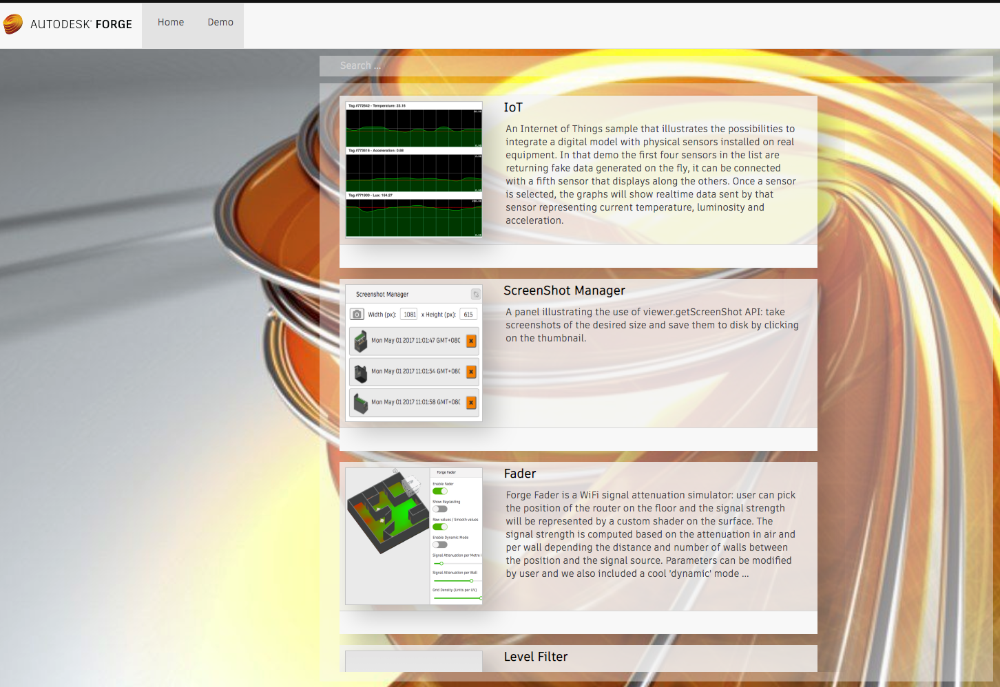

## Description

A curated collection of various JavaScript extensions for the viewer, showing what is doable with the client-side JavaScript API.

** Many of the extensions in this compilation are taken from the [forge-rcdb.nodejs](https://github.com/Autodesk-Forge/forge-rcdb.nodejs/tree/remastered/src) project **

## Prerequisites

- Install [NodeJS](https://nodejs.org).

- Clone this project or download it. It's recommended to install [GitHub desktop](https://desktop.github.com/). To clone it via command line, use the following (**Terminal** on MacOSX/Linux, **Git Shell** on Windows)

## Running the Extension Gallery



### Project Setup

   * Clone the project: `git clone <ProjectURL>`

### Running the Application

- Navigate to the project folder

- Run the application:

  ```
  npx json-server data/default.json --routes routes/routes.json --ro
  ```

- Browse to http://localhost:3000 to view the application

### Known Limitations

- All data is readonly since there's no live database connected.
- Websocket will not work since there's no backend service running.
- In-app navigation is based on the browser history API with no backend running so navigating with URLs like `http://localhost:3000/database?id=57f3739777c879f48ad54a44` will not work.
- Few other ignorable runtime errors are expected as a result of being disconnected from a live database.

To enable the features above see [forge-rcdb.nodejs](https://github.com/Autodesk-Forge/forge-rcdb.nodejs/tree/remastered/src).

## Viewer Extensions

### Usage

There is a precompiled, ready to use in the `dist` directory of each extension.

Simply reference and load the extension in your app, for example:

```
<script language="JavaScript" src="Viewing.Extension.Markup3D.js"></script>

...

const viewer = new Autodesk.Viewing.Private.GuiViewer3D( container, {extensions:['Viewing.Extension.Markup3D']});

//or

viewer.loadExtension('Viewing.Extension.Markup3D')

```

### Description

* [Autodesk.ADN.Viewing.Extension.Basic](./extensions/Autodesk.ADN.Viewing.Extension.Basic)

A basic Hello World extension that displays an alert dialog upon loading and unloading.

* [Autodesk.ADN.Viewing.Extension.BasicES2015](./extensions/Autodesk.ADN.Viewing.Extension.BasicES2015)

A Hello World extension but written using ES6/ES2015 syntax. Needs transpiling with a tool like Babel or Traceur before being used with the viewer.

* [Autodesk.ADN.Viewing.Extension.BoundingBox](./extensions/Autodesk.ADN.Viewing.Extension.BoundingBox)

Displays a bounding box around the selected component.

* [Autodesk.ADN.Viewing.Extension.Chart](./extensions/Autodesk.ADN.Viewing.Extension.Chart)

Displays a PieChart and a dropdown menu listing all available model properties. When a pie is selected in the chart, isolates the specific components.

* [Autodesk.ADN.Viewing.Extension.ContextMenu](./extensions/Autodesk.ADN.Viewing.Extension.ContextMenu)

Illustrates how to customize the viewer context menu for zero-selection menu or item specific menu.

* [Autodesk.ADN.Viewing.Extension.CustomTool](./extensions/Autodesk.ADN.Viewing.Extension.CustomTool)

A basic viewer tool that just dumps events in the console, useful for testing and debugging or using as a tool boilerplate.

* [Autodesk.ADN.Viewing.Extension.DockingPanel](./extensions/Autodesk.ADN.Viewing.Extension.DockingPanel)

A basic docking panel demo.

* [Autodesk.ADN.Viewing.Extension.EventWatcher](./extensions/Autodesk.ADN.Viewing.Extension.EventWatcher)

Creates a panel which lets user activates any event available in the API. Output event arguments to a section.

* [Autodesk.ADN.Viewing.Extension.Explorer](./extensions/Autodesk.ADN.Viewing.Extension.Explorer)

Creates a camera animation using a custom tool, rotating eye position around the model.

* [Autodesk.ADN.Viewing.Extension.GeometrySelector](./extensions/Autodesk.ADN.Viewing.Extension.GeometrySelector)

Illustrates how to snap geometry: vertices, edges, faces and how to create selection commands to let user pick geometry on the model.

* [Autodesk.ADN.Viewing.Extension.Hotkeys](./extensions/Autodesk.ADN.Viewing.Extension.Hotkeys)

Creates hotkeys to switch viewer to fullscreen.

* [Autodesk.ADN.Viewing.Extension.IFramePanel](./extensions/Autodesk.ADN.Viewing.Extension.IFramePanel)

Creates a simple docking panel containing an iframe.

* [Autodesk.ADN.Viewing.Extension.Layers](./extensions/Autodesk.ADN.Viewing.Extension.Layers)

Iterates through layers. Valid only for 2D drawings.

* [Autodesk.ADN.Viewing.Extension.Markup3D**](./extensions/Autodesk.ADN.Viewing.Extension.Markup3D**)

Add 3D markups on a 3D model. Uses StateManager extension to save & restore markups.

* [Autodesk.ADN.Viewing.Extension.Material](./extensions/Autodesk.ADN.Viewing.Extension.Material)

Changes material of selected component. Supports color and textures.

* [Autodesk.ADN.Viewing.Extension.MeshData](./extensions/Autodesk.ADN.Viewing.Extension.MeshData)

Access mesh data of selected component, vertices and edges to represent them graphically.

* [Autodesk.ADN.Viewing.Extension.MeshImporter](./extensions/Autodesk.ADN.Viewing.Extension.MeshImporter)

Imports custom json into the viewer and creates three.js meshes from it.

* [Autodesk.ADN.Viewing.Extension.MetaProperties](./extensions/Autodesk.ADN.Viewing.Extension.MetaProperties)

Adds some extra hardcoded properties to viewer property panel.

* [Autodesk.ADN.Viewing.Extension.ModelStructure](./extensions/Autodesk.ADN.Viewing.Extension.ModelStructure)

Dumps model structure to browser console.

* [Autodesk.ADN.Viewing.Extension.ModelStructurePanel](./extensions/Autodesk.ADN.Viewing.Extension.ModelStructurePanel)

Custom model structure panel behavior.

* [Autodesk.ADN.Viewing.Extension.PropertyDump](./extensions/Autodesk.ADN.Viewing.Extension.PropertyDump)

Dumps properties for selected component in browser console.

* [Autodesk.ADN.Viewing.Extension.PropertyListPanel](./extensions/Autodesk.ADN.Viewing.Extension.PropertyListPanel)

Custom panel derived from property list panel

* [Autodesk.ADN.Viewing.Extension.PropertyPanel](./extensions/Autodesk.ADN.Viewing.Extension.PropertyPanel)

Inserts custom data into viewer property panel.

* [Autodesk.ADN.Viewing.Extension.PropertyTranslator](./extensions/Autodesk.ADN.Viewing.Extension.PropertyTranslator)

Uses microsoft translation API to translate property panel values on the fly.

* [Autodesk.ADN.Viewing.Extension.StateManager**](./extensions/Autodesk.ADN.Viewing.Extension.StateManager**)

Save and restore states of the viewer (position, markups, rotation, zoom, etc). This extension requires a backend implementation to store the states. To load it on viewer, use the **loadExtension** method with the following parameters: **apiUrl** that specifies the endpoints to call to save & restore states; and `model._id` that is passed to identify the model.

    viewer.loadExtension('Viewing.Extension.StateManager',
      {
        apiUrl: 'http://localhost:3000/api/',
        model: {_id: 'YourModelUrn'}
      }
    );

* [Autodesk.ADN.Viewing.Extension.ScreenShotManager](./extensions/Autodesk.ADN.Viewing.Extension.ScreenShotManager)

Creates a panel that lets you manage screenshots taken with the API.

* [Autodesk.ADN.Viewing.Extension.Toolbar](./extensions/Autodesk.ADN.Viewing.Extension.Toolbar)

Various toolbar controls customization example.

* [Autodesk.ADN.Viewing.Extension.UIComponent](./extensions/Autodesk.ADN.Viewing.Extension.UIComponent)

Illustrates on to create a docking panel more advanced than the basic docking panel extension.

* [Autodesk.ADN.Viewing.Extension.Workshop](./extensions/Autodesk.ADN.Viewing.Extension.Workshop)

A demo extension which illustrates several concepts of the API. See the complete [tutorial](https://github.com/Developer-Autodesk/tutorial-getting.started-view.and.data) for more details.

## Modify and Compile the Extensions

### Edit the Source Code

The source code can found in the directories of each extension.

### Build the Extensions

Navigate to the folder and run **install** to download all the required dependencies:

    npm install

By default, right after **install**, the build script should will run automatically, which will build the minified JavaScript files. If not (or to run in manually later), use the following:

    npm run build


## Tips and Tricks

> Is there a way to add my own models

To add models to the home page simply add a new object to `rcdb.models` in your `data/default.json` and to `configurator.models` for the `Demo` page following the schema below:

```
"_id": "Model GUID - can use https://guidgenerator.com to generate",
"id": "Model GUID - can use https://guidgenerator.com to generate",
"name": "Model name goes here",
"env": "Local",
"desc": "Description goes here",
"layout": {
  "type": "flexLayoutRight",
  "rightFlex": 0.3
},
"model": {
  "path": "path/to/svf",
  "name": "Model name goes here",
  "role": "3d"
  //...other model load options if any
},
"dynamicExtensions": [
//Extensions to load
]
```

## Written by

Forge Partner Development - [http://forge.autodesk.com](http://forge.autodesk.com)
